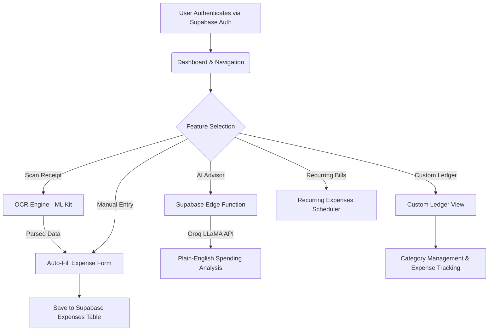

# Personal Ledger — Android App (V1.0.0) — Product Proposal & Technical Showcase

A vendor-ready proposal and technical overview demonstrating the design, functionality, and market positioning of the **Personal Ledger** Android mobile application.

---

## 1. Executive Summary

### The Problem
Personal finance is one of the most high-impact yet underserved areas on Android. Most users either rely on complex, cluttered banking dashboards that overwhelm them, or use generic spreadsheet tools that offer zero intelligence. Paper receipts get lost. Monthly budgets go untracked. Recurring subscriptions pile up silently. And for users managing multiple income sources, custom savings buckets, or freelance ledgers — there is no single focused tool.

### The Solution
**Personal Ledger** is a premium, cloud-connected Android application that transforms how individuals track, analyze, and understand their personal finances. It combines real-time expense tracking, intelligent receipt OCR scanning, AI-driven spending analysis, recurring bill management, and custom financial ledgers — all through a beautifully designed, frictionless mobile experience.

### Value Proposition
- **AI-Powered Insights**: Groq LLaMA-powered AI Advisor delivers plain-English spending summaries and recommendations, directly in the app.
- **One-Tap Receipt Scanning**: Uses native on-device Google ML Kit OCR to instantly parse receipts — extracting vendor name, date, amount, and category without any cloud upload.
- **Custom Financial Ledgers**: Users create named, purpose-specific ledgers (e.g., "Grocery Fund", "Trip to Goa") with their own expense categories and separate summaries.
- **Live Cloud Sync**: Supabase Postgres backend with Row-Level Security (RLS) ensures all personal data syncs securely across sessions, tied exclusively to the authenticated user.
- **100% Private by Default**: On-device OCR means receipt images never leave the phone. Backend data is protected by database-enforced access control — no shared data between users.

---

## 2. Core Functionality Built (V1.0.0)

### 1. Expense Tracking
Add, edit, and delete daily expenses with date, amount, category, and optional notes. A real-time summary card shows monthly totals, top spending categories, and a visual breakdown chart — all pulled live from the Supabase database.

### 2. Income Management
Track income entries with source classification (Salary, Business, Investments, Others), date, and notes. Monthly income totals are calculated and displayed alongside expenses to show net savings at a glance.

### 3. Native Receipt OCR Scanning
A single tap on **Scan Receipt** launches a bottom sheet giving the user a choice of camera or gallery. The image is processed locally using **Google ML Kit Text Recognition**, extracting:
- **Vendor / Shop Name** — heuristically parsed from the first non-header lines.
- **Transaction Date** — matched against multiple date formats and normalized to `YYYY-MM-DD`.
- **Total Amount** — identified by `Grand Total`, `Bill Amount`, `Paid` keywords and currency pattern matching.
- **Smart Category Suggestion** — maps vendor keywords (e.g. "Lassi Story" → `Food`) using a built-in keyword taxonomy.
All parsed fields auto-populate the expense form instantly.

### 4. AI Spending Advisor
A dedicated **Analysis** screen connects to a Supabase Edge Function (Deno/TypeScript) which securely calls the **Groq LLaMA-3.3-70b-versatile** model. The user selects a time period (Last Month / Last 3 Months / Last 6 Months) and receives:
- Plain-language narrative of category spending trends.
- Key overspending alerts and budget insights.
- Practical, personalized suggestions to improve financial health.

### 5. Custom Financial Ledgers
Users create named ledgers for any purpose. Each ledger has:
- Its own independently managed category list.
- Separate expense entries (stored with a `ledger_id` reference in Supabase).
- Dedicated income tracking.
- AI advisor analysis scoped to that ledger only.
- CSV export functionality for sharing or archiving.

### 6. Recurring Expenses
Track recurring subscriptions and bills (monthly, weekly, custom cycles). The recurring tab shows upcoming due dates, active/inactive status toggle, and monthly impact totals — preventing bill surprises.

---

## 3. Technology Stack

The application is built using modern cross-platform tools with a native Android-first experience:

- **Language & Framework**: Dart (Flutter 3.x), compiled to native ARM Android bytecode with `minSdk 23` (Android 6.0+) and `targetSdk 35`.
- **UI Engine**: Flutter Material 3 with a fully custom retro-editorial design theme — warm parchment tones, serif typography (`Playfair Display`, `Lora`), and canvas-drawn bar charts using `fl_chart`.
- **Architecture**: MVVM (Model-View-ViewModel) pattern with `ChangeNotifier` state management, repository pattern for data access, and clean separation of UI, data, and service layers.
- **Backend**: Supabase (Postgres) with database-enforced Row-Level Security (RLS). All queries are scoped to `auth.uid() = user_id` at the database level — no client-side trust.
- **Authentication**: Supabase Auth (JWT-based email/password authentication with session persistence).
- **AI / LLM**: Groq API (`llama-3.3-70b-versatile`) called via a Supabase Edge Function (Deno TypeScript), keeping the API key server-side and secure.
- **OCR Engine**: `google_mlkit_text_recognition` (ML Kit Latin text recognition) — 100% on-device, zero network calls for image processing.
- **Image Capture**: `image_picker` — native camera and gallery access via Android Media APIs.
- **Data Export**: `pdf` + `open_file` packages for generating and sharing CSV / PDF reports.
- **QA**: Unit-tested receipt parsing engine (`flutter test`) with real-world receipt text fixtures.

---

## 4. Target Use Cases & Market Fit

### Case A: The Daily Budget Tracker
- **Persona**: Working professionals who want to log daily expenses quickly and review monthly spending without complexity.
- **Fit**: The clean, minimal expense form with **Scan Receipt** OCR means adding an expense takes under 5 seconds. The dashboard delivers instant category insights.

### Case B: The Freelancer / Small Business Owner
- **Persona**: Freelancers managing client project budgets, business travel expenses, or category-specific funds.
- **Fit**: Custom Ledgers allow creation of per-project or per-client financial contexts with separate categories, AI insights, and exportable reports.

### Case C: The AI-Powered Finance Optimizer
- **Persona**: Users who want data-driven, personalized financial advice without sharing data with third-party services.
- **Fit**: The AI Advisor synthesizes spending history and delivers tailored budget recommendations directly in the app — powered by Groq's ultra-fast LLaMA inference.

### Case D: The Receipt-Driven Expense Reporter
- **Persona**: Employees on business trips who need to photograph, categorize, and record receipts quickly for reimbursement reports.
- **Fit**: The OCR scanner auto-parses restaurant, hotel, and taxi receipts in one tap, reducing manual entry entirely.

---

## 5. Quality Assurance

To support vendor confidence and production readiness, the V1.0.0 release includes:

- **Unit Test Suite**: `ReceiptParser` is covered by automated unit tests using real-world receipt OCR text (Indian restaurant receipts with Hindi vendor names, ₹ amounts, and multi-item bills). Tests verify vendor extraction, date normalization, amount parsing, and Food category classification.
- **Static Analysis**: All Dart code passes `flutter analyze` with zero errors and zero warnings.
- **Build Verification**: A fully compiled `app-debug.apk` has been generated, installed, and manually verified on a physical Android device (`CPH2667` — OnePlus Nord CE 3 5G) over a wireless ADB connection.
- **End-to-End Manual Testing**: All six major screens (Auth, Expenses, Income, Recurring, Custom Ledgers, AI Advisor) have been tested with live Supabase data, confirming correct RLS enforcement, data isolation, and real-time sync.

---

## 6. Security & Privacy Architecture

| Layer | Mechanism |
|-------|-----------|
| Authentication | Supabase JWT Auth — session stored securely on-device |
| Database Access | Row-Level Security (RLS) on all tables — `auth.uid() = user_id` |
| AI API Keys | Server-side only in Supabase Edge Functions — never exposed to clients |
| Receipt Images | Processed entirely on-device via ML Kit — never uploaded to any server |
| Data Isolation | Every database query is scoped to the authenticated user's ID |

---

## 7. Future Enhancements & Roadmap

With **V1.0.0** successfully built and verified, future iterations will deliver:

1. **Push Notification Alerts**: Notify users when recurring bills are due, or when monthly spending exceeds a configured budget threshold.
2. **Multi-Currency Support**: Allow users to set a base currency and track foreign expenses with conversion rates.
3. **Bank Statement Import**: Auto-parse PDF or CSV bank statements to bulk-import transactions.
4. **Spending Goals & Savings Targets**: Let users set category-level monthly limits and visualize progress toward savings goals.
5. **Biometric Lock**: App-level fingerprint or face unlock to protect financial data on shared devices.
6. **iOS Release**: Extend the Flutter codebase to publish on the Apple App Store.
