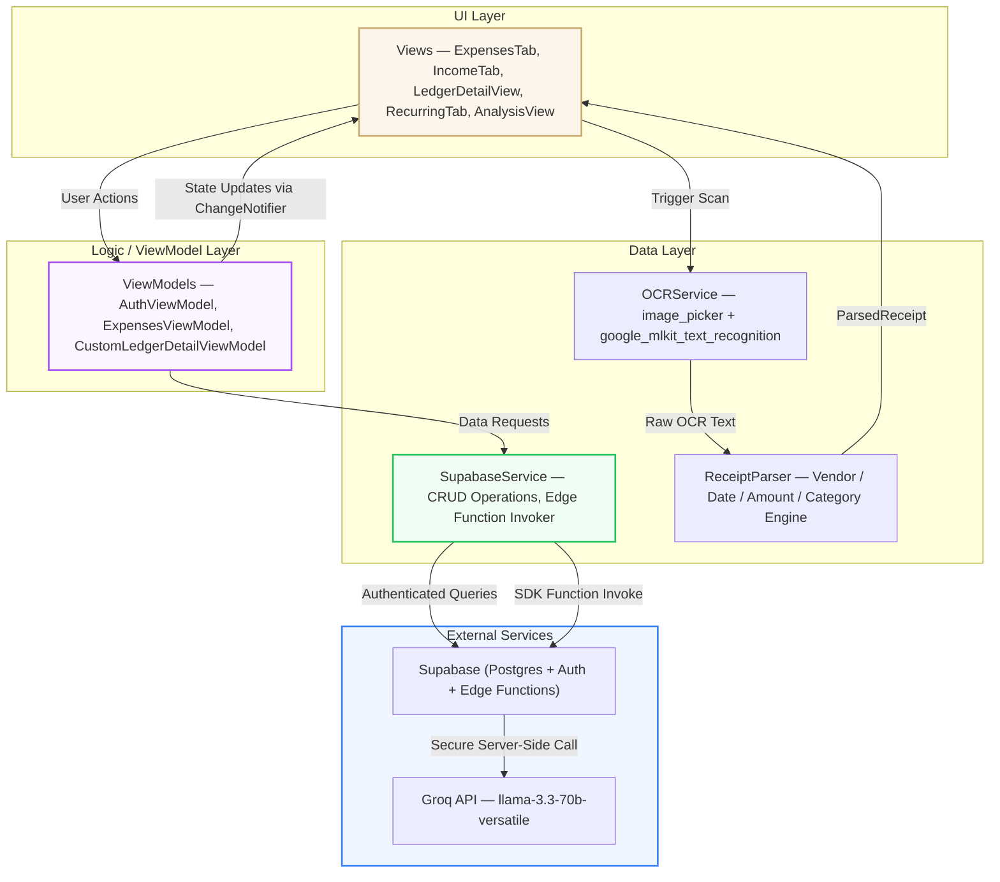
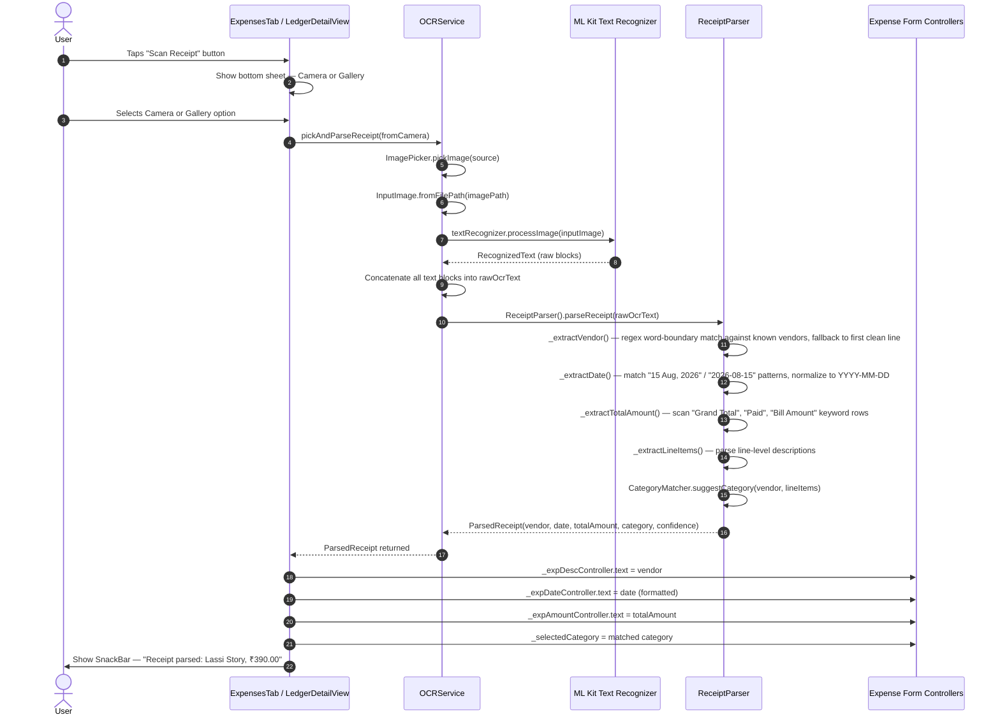
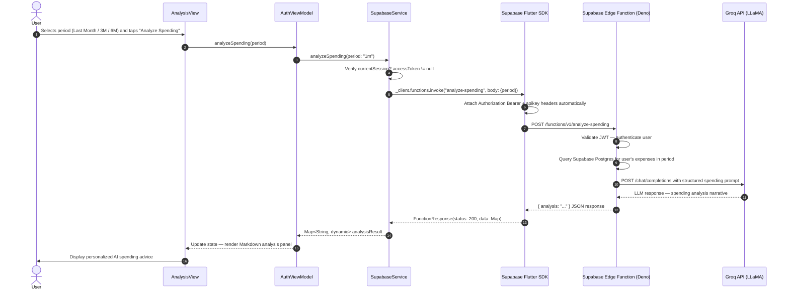
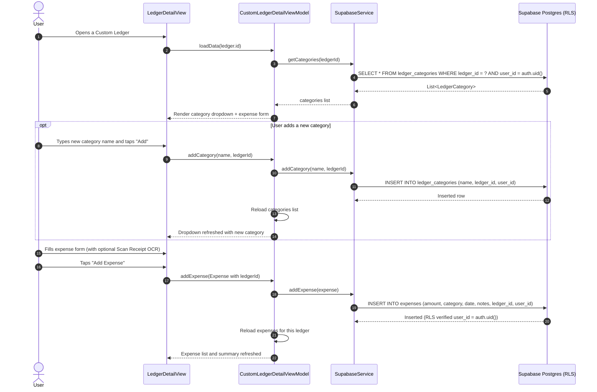
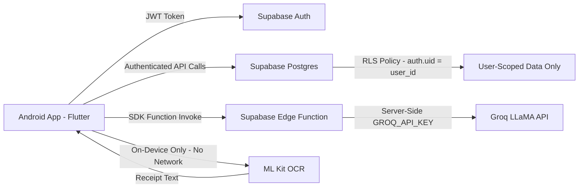

# Personal Ledger — Android App (V1.0.0) — Technical Architecture & System Documentation

An investor-grade master document detailing the architectural design, system flows, and technical implementation of the Personal Ledger Android mobile application.

---

## 1. Executive Summary

The **Personal Ledger Android App** is a cross-platform (Flutter/Dart), cloud-backed mobile application purpose-built for personal financial management. It provides expense tracking, income logging, receipt OCR scanning, recurring bill management, custom ledgers, and AI-powered spending analysis — all secured via Supabase's JWT-based authentication and database-enforced Row-Level Security.

### Technical Problem Solved
Financial apps either compromise on privacy (cloud-uploaded receipt images) or on intelligence (dumb spreadsheet-style inputs with no AI assistance). Personal Ledger bridges this gap by running **OCR entirely on-device** (no images leave the phone) while routing AI analysis through a **secure serverless Edge Function** (no API keys ever exposed to clients). All data is stored in a **Postgres backend with enforced row-level access control** — making unauthorized data access architecturally impossible, not just policy-dependent.

---

## 2. Core Features (V1.0.0)

- **Supabase Auth Integration**: JWT-based email/password authentication with persistent session management and auto-refresh.
- **Expense Tracking**: Create, edit, and delete expenses with date, amount, category dropdown (Food, Transport, Utilities, Health, Entertainment, Shopping, Education, Others), and notes. Monthly summaries and bar charts computed from live data.
- **Income Tracking**: Log income entries by source (Salary, Business, Investments, Others) with date and notes. Net savings displayed dynamically.
- **Native OCR Receipt Scanning**: `google_mlkit_text_recognition` processes captured or gallery-selected receipt images entirely on-device. A custom `ReceiptParser` Dart engine extracts vendor, date, amount, and category using regex heuristics and keyword taxonomy.
- **AI Spending Advisor**: Calls a Supabase Edge Function (Deno TypeScript) which relays a structured prompt to Groq's `llama-3.3-70b-versatile` model. Returns a Markdown-rendered analysis panel with spending insights.
- **Custom Financial Ledgers**: User-created named ledgers with independently managed categories, separate expense tracking, income tracking, AI advisor, and CSV export.
- **Recurring Expenses Scheduler**: Tracks bills and subscriptions with configurable frequency, amount, and active/inactive status toggle.
- **PDF & CSV Export**: Generates reports from expense data using the `pdf` package and opens them with native file viewer integration.
- **Retro Editorial Theme**: Warm parchment colour palette, serif typography (`Playfair Display` headings, `Lora` body), and custom `fl_chart` canvas-drawn bar charts — a premium UI aesthetic unlike standard Material apps.

---

## 3. High-Level System Architecture

The application follows a clean **MVVM (Model-View-ViewModel)** architecture with a service layer for external integrations:

---

## 4. System Flow Diagrams

### Flow A: Receipt OCR Scanning & Form Auto-Fill

This diagram details the on-device receipt scanning pipeline from image capture to expense form population:

---

### Flow B: AI Spending Advisor — Secure Edge Function Invocation

This diagram shows how the AI analysis request flows securely through the Supabase SDK, bypassing raw HTTP and ensuring API keys remain server-side:

---

### Flow C: Custom Ledger — Category Management & Expense Entry

This diagram details the custom ledger expense creation flow including dynamic category management:

---

## 5. Database Schema (Supabase Postgres)

All tables enforce Row-Level Security (`user_id = auth.uid()`).

| Table | Key Columns | Description |
|-------|-------------|-------------|
| `expenses` | `id, user_id, ledger_id, amount, category, expense_date, notes` | All expense records. `ledger_id` is NULL for personal expenses, populated for custom ledgers. |
| `income` | `id, user_id, ledger_id, amount, source, income_date, notes` | Income records per user or per ledger. |
| `ledgers` | `id, user_id, name, description, color, created_at` | User-created custom financial ledgers. |
| `ledger_categories` | `id, user_id, ledger_id, name` | Custom expense categories per ledger. |
| `recurring_expenses` | `id, user_id, name, amount, frequency, next_due_date, is_active` | Recurring subscription and bill entries. |
| `user_settings` | `id, user_id, alert_email, phone_number, sms_enabled` | Per-user notification preferences. |

---

## 6. Security & Data Privacy Design

- **JWT Authentication**: Every request is authenticated via a Supabase session JWT. Tokens are refreshed automatically and stored securely on-device.
- **Row-Level Security**: Postgres RLS policies enforce that every `SELECT`, `INSERT`, `UPDATE`, and `DELETE` operation is scoped to the authenticated `user_id`. Cross-user data access is physically impossible at the database layer.
- **Edge Function Security**: The Groq API key lives exclusively in Supabase Edge Function environment variables. It is never bundled in the app binary, never logged, and never transmitted to clients.
- **On-Device OCR**: Receipt images are processed by ML Kit's local text recognition model. No image is transmitted to any external server.

---

## 7. Future Enhancements & Roadmap

With the foundation of **V1.0.0** successfully established and verified, future iterations will implement:

1. **Push Notification Engine**: Supabase `pg_cron` + `pg_net` to trigger daily/weekly budget alerts via Firebase Cloud Messaging (FCM).
2. **Multi-Currency Support**: Currency selection in user settings with live exchange rate conversion (via open exchange rates API).
3. **Bank Statement Auto-Import**: Parse PDF or CSV bank statement exports to bulk-import transaction history.
4. **Spending Goals & Budget Caps**: User-defined category budget limits with progress rings and breach alerts.
5. **Biometric App Lock**: `local_auth` package integration for fingerprint / face unlock on app open.
6. **iOS App Store Launch**: Extend the Flutter codebase, configure Supabase deep link handlers, and publish on the Apple App Store.
7. **Offline Mode with Sync Queue**: Local SQLite cache with a conflict-resolving sync queue for zero-network usage.
